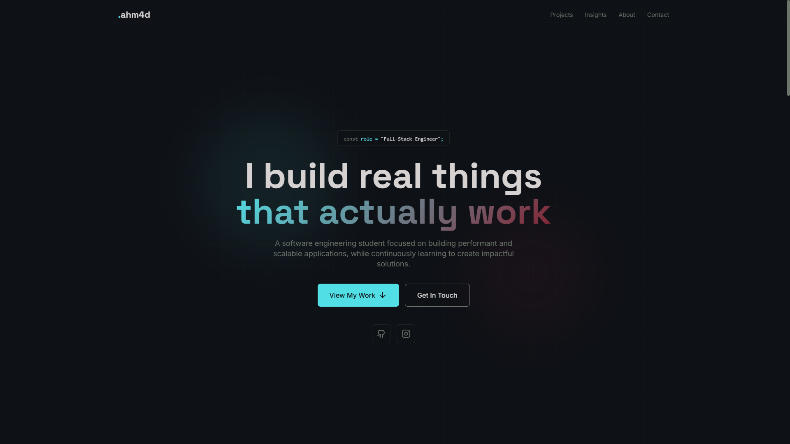

Ahmad Putra Ramadhan - Personal Portfolio

A modern, responsive, and minimal portfolio website built with **React**, **Vite**, and **Tailwind CSS**. This project showcases my projects, skills, and insights as a Full-Stack Engineer student.


---

## 📸 Screenshots


 


---

## ✨ Key Features

- **Modern UI/UX**: Clean design with Glassmorphism effects and dark mode support.
- **Fully Responsive**: Optimized for mobile, tablet, and desktop views.
- **Animated Interactions**: Smooth animations powered by Framer Motion.
- **Dynamic Sidebar**: Mobile-friendly navigation with an animated sidebar.
- **SEO Optimized**: Meta tags and Open Graph tags included for better search engine visibility.
- **Custom Icons**: Handcrafted SVG icons to reduce external dependencies.

---

## 🛠️ Built With

This project was built using these technologies:

- **[React.js](https://reactjs.org/)** - A JavaScript library for building user interfaces.
- **[Vite](https://vitejs.dev/)** - Next Generation Frontend Tooling.
- **[Tailwind CSS](https://tailwindcss.com/)** - A utility-first CSS framework.
- **[Framer Motion](https://www.framer.com/motion/)** - Production-ready animations for React.
- **[Lucide React](https://lucide.dev/)** - Beautiful & consistent icon toolkit.

---

## 🚀 Getting Started

To get a local copy up and running, follow these simple steps.

### Prerequisites

Make sure you have **Node.js** (version 16 or higher) installed on your machine.

- [Download Node.js](https://nodejs.org/en/download/)

### Installation

1. **Clone the repo**
   ```sh
   git clone https://github.com/username/your-repo-name.git
   ```
   *(Ganti URL di atas dengan link repository GitHub kamu)*

2. **Navigate to the project folder**
   ```sh
   cd your-repo-name
   ```

3. **Install dependencies**
   ```sh
   npm install
   ```

4. **Start the development server**
   ```sh
   npm run dev
   ```

5. **Open in browser**
   Open `http://localhost:5173` (or the port shown in your terminal) to view it in the browser.

---

## 📁 Project Structure

Here is the folder structure of this project:

```text
src/
├── components/       # Reusable UI components (Button, etc)
├── sections/         # Main sections of the page (Hero, Navbar, etc)
├── App.jsx           # Main application component
├── main.jsx          # Entry point of the application
└── index.css         # Global styles & Tailwind directives
public/
├── favicon.svg       # Browser tab icon
└── og-image.png      # Image for social media sharing (Open Graph)
```

---

## 🎨 Customization

To customize this portfolio for your own use:

1. **Content**: Edit the strings inside `src/sections/Hero.jsx` and other section files.
2. **Colors**: Modify `tailwind.config.js` to change the primary color palette (`accent`, `burgundy`, etc).
3. **Images**: Replace `favicon.svg` and add your project screenshots to the `public` or `src/assets` folder.
4. **SEO**: Update the `index.html` file with your name, description, and image links.

---

## 👤 Author

**Ahmad Putra Ramadhan**

- **GitHub**: [@ahm4d-putra](https://github.com/ahm4d-putra
- **Instagram**: [@ahmaddd9_](https://instagram.com/ahmaddd9_)

---

## 📝 License

This project is open source and available under the [MIT License](LICENSE).

---


